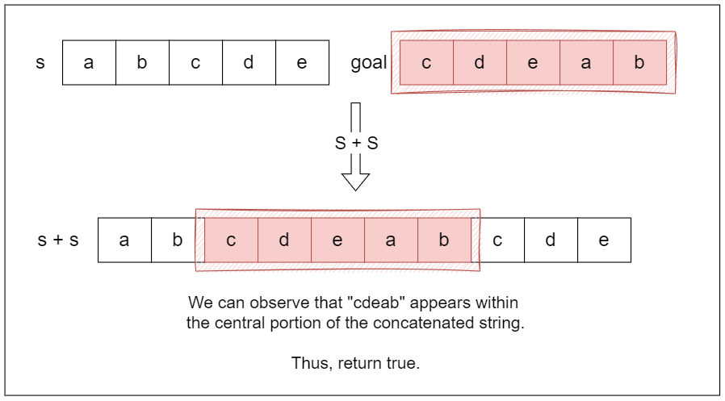

<h2><a href="https://leetcode.com/problems/rotate-string">0796. Rotate String</a></h2><h3>Easy</h3><hr><p>Given two strings <code>s</code> and <code>goal</code>, return <code>true</code> <em>if and only if</em> <code>s</code> <em>can become</em> <code>goal</code> <em>after some number of <strong>shifts</strong> on</em> <code>s</code>.</p>

<p>A <strong>shift</strong> on <code>s</code> consists of moving the leftmost character of <code>s</code> to the rightmost position.</p>

<ul>
	<li>For example, if <code>s = &quot;abcde&quot;</code>, then it will be <code>&quot;bcdea&quot;</code> after one shift.</li>
</ul>

<p>&nbsp;</p>
<p><strong class="example">Example 1:</strong></p>
<pre><strong>Input:</strong> s = "abcde", goal = "cdeab"
<strong>Output:</strong> true
</pre><p><strong class="example">Example 2:</strong></p>
<pre><strong>Input:</strong> s = "abcde", goal = "abced"
<strong>Output:</strong> false
</pre>
<p>&nbsp;</p>
<p><strong>Constraints:</strong></p>

<ul>
	<li><code>1 &lt;= s.length, goal.length &lt;= 100</code></li>
	<li><code>s</code> and <code>goal</code> consist of lowercase English letters.</li>
</ul>

## Approach 2: Concatenation Check

### Intuition
Instead of rotating the string and checking after each rotation, we can observe a relationship between s and goal. If goal can be formed by rotating s, it must be possible to find goal as a substring in some version of s.

A clever way to exploit this is by concatenating s with itself. Why? Because this effectively creates a string that contains all possible rotations of s within it. For example, if s = "abcde", then s + s = "abcdeabcde". Notice how every possible rotation of s appears somewhere in this concatenated string.

So, if goal can be obtained by rotating s, it must be a substring of s + s. To implement this, we simply check if goal is a substring of the concatenated string. If it is, we return true; otherwise, we return false.



### Algorithm
1. Check if the lengths of strings s and goal are different:

	- If they are, return false because a rotation of s cannot match goal.
2. Create a new string doubledString by concatenating s with itself.

3. Use a string search method to find the substring goal within doubledString:

	- If goal is found, check if this index is less than the length of doubledString.
	- If it is, return true, indicating that goal is a valid rotation of s. Otherwise, return false

### Java Solution

```Java
class Solution {
    public boolean rotateString(String s, String goal) {
        // Step 1: Check if the lengths are different
        if (s.length() != goal.length()) return false;

        // Step 2: Create a new string by concatenating 's' with itself
        String doubledString = s + s;

        // Step 3: Use contains to search for 'goal' in 'doubledString'
        // If contains return true, 'goal' is a substring
        return doubledString.contains(goal);
    }
}

```

### Complexity Analysis

Let n be the size of string s (and also the size of string goal, since they must be of equal length to be rotations).

#### Time complexity: O(n)

Checking if the lengths of both strings are different takes O(n).

Concatenating the string s with itself to create doubledString takes O(n) because we are creating a new string that is twice the length of s.

The substring find function is typically implemented using an algorithm that runs in O(n). This involves scanning the doubledString of length 2n for the substring goal of length n. Since the search occurs in a string of size 2n, the overall complexity for this operation remains O(n).

Overall, the most significant operations are linear in terms of n, resulting in a total time complexity of O(n).

#### Space complexity: O(n)

The space used for the doubledString is O(n) since it stores a string that is double the size of s (specifically, O(2⋅n)≈O(n)).

Thus, the overall space complexity is O(n) due to the concatenated string.